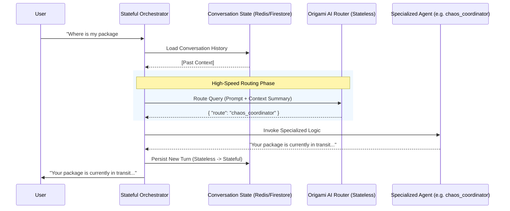

# Origami AI Router Performance & Cost Comparison

This report details comparative throughput scaling and architectural costs across tested routing implementations.

---

## Benchmark Assumptions

- **Target Load**: Sustained 120 Requests Per Second (RPS) — approximately **311 Million requests/month**.
- **Environment**: High-Availability (HA) Google Cloud environment (GKE or Cloud Run for Anthropic/Gemini, Compute Engine for local models). Minimum 2 nodes required for redundancy for self-hosted architectures.
- **Hardware Pricing**: Standard Google Cloud `n2-standard-8` CPU or `L4` GPU instance pricing.
- **Token Volume**: ~50 tokens per request average (15.5 Billion tokens/month).

---

## Throughput & Cost Comparison

| Router Implementation | Average RPS | Cost (HA at 120 RPS) | Pros & Cons |
|-----------------------|-------------|----------------------|-----------------------|
| **Ember (Fast-Tier)** *(CPU Only)* | **~48.0 RPS** *(Mac M3 Baseline)* | **~$100 / mo** *(Requires ~3 CPU nodes)* | **Pros**: Ultra-cheap, sub-20ms local embedding interception. **Cons**: Lower absolute accuracy (zero-shot maxes ~50-60%). Best as threshold interceptor. |
| **Llama.cpp** *(CPU Only)* | **10.86 RPS** *(Mac M3 Baseline)* | **~$3,300 / mo** *(Requires ~12 CPU nodes)* | **Pros**: Cross-platform support, no GPU dependencies. **Cons**: High latency per request, limited throughput concurrency. |
| **Llama.cpp Worker Pool** *(GPU Offload)* | **26.38 RPS** *(RTX 4090)* | **~$2,500 / mo** *(Requires ~5 L4 GPU nodes)* | **Pros**: Strict GBNF grammar guarantee, hybrid GPU offloading. **Cons**: No continuous batching, VRAM duplication across processes. |
| **vLLM Engine** *(Native GPU Batching)* | **501.88 RPS** *(RTX 4090)* | **~$1,000 / mo** *(Requires 2 L4 GPU nodes for HA)* | **Pros**: Continuous batching with PagedAttention (200+ concurrent requests). **Cons**: Linux + NVIDIA GPU hardware requirements. |
| **Gemini Flash API** *(Cloud Hosted)* | **5.34 RPS** *(Global Endpoint)* | **Variable / High** *(Depends on PT size)* | **Pros**: Zero hardware infrastructure management. **Cons**: Subject to strict API token quotas requiring Provisioned Throughput (PT) for 120+ RPS. |

---

## High Volume Scaling Projections

Monthly estimated cost and infrastructure node count (including minimal N+1 High Availability redundancy) to sustain enterprise transaction loads (TPS) 24/7:

| Target TPS | vLLM Engine (L4 GPU) | Llama.cpp (L4 GPU) | Gemini Flash API (Volume Pricing)* |
|------------|------------------------|-------------------------------|-------------------------------------|
| **500 TPS** | **~$1,000 / mo** *(2 Nodes: 1 Active, 1 HA)* | **~$10,500 / mo** *(21 Nodes)* | **~$4,860 / mo** *(1.3 Billion reqs/mo)* |
| **1,000 TPS**| **~$1,500 / mo** *(3 Nodes: 2 Active, 1 HA)* | **~$20,500 / mo** *(41 Nodes)* | **~$9,720 / mo** *(2.6 Billion reqs/mo)* |
| **5,000 TPS**| **~$5,500 / mo** *(11 Nodes: 10 Active, 1 HA)* | **~$100,500 / mo** *(201 Nodes)* | **~$48,600 / mo** *(13 Billion reqs/mo)* |
| **10,000 TPS**| **~$10,500 / mo** *(21 Nodes: 20 Active, 1 HA)*| **~$200,500 / mo** *(401 Nodes)* | **~$97,200 / mo** *(26 Billion reqs/mo)* |

*\*Note: Guaranteeing 1,000+ continuous TPS on Gemini requires reserving Provisioned Throughput (PT) from Google Cloud to bypass quota limits.*

---

## Architectural Sequence Diagram

---

## Executive Summary

When evaluating routing architectures for a sustained 120 RPS load:

1. **The Interception Layer (Ember CPU)**: Deploying `EmberRouter` (`BAAI/bge-m3`) at the edge delivers sub-20ms intent classification for ~50% of queries at ~$100/mo.
2. **Self-Hosted Winner (vLLM on GKE)**: `vLLM` comfortably exceeds 500 RPS via PagedAttention. Standard HA configuration requires only **two base L4 GPU nodes** (~$1,000/mo), outperforming `llama.cpp` by orders of magnitude.
3. **Managed Option (Gemini Flash API)**: Eliminates Kubernetes operational overhead but requires Provisioned Throughput (PT) reservations for high sustained RPS workloads to guarantee strict SLAs.
