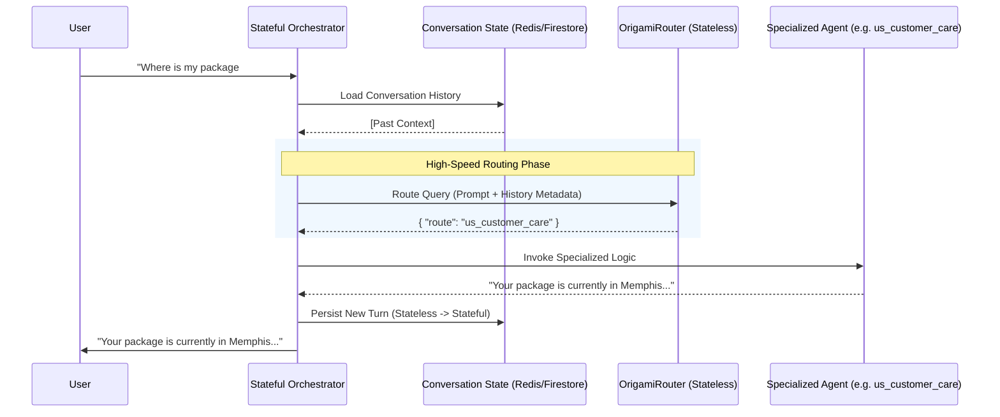

# Origami Router Performance & Cost Comparison

This report details the comparative throughput scaling and architectural costs of the different routing implementations tested.

### Assumptions for Cost Analysis
* **Target Load**: Sustained 120 Requests Per Second (RPS) — roughly **311 Million requests/month**.
* **Environment**: High-Availability (HA) Google Cloud environment (GKE or Cloud Run for Anthropic/Gemini, Compute Engine for local models). Minimum 2 nodes required for redundancy for self-hosted architectures.
* **Hardware Pricing**: Evaluated using standard Google Cloud `n2-standard-8` CPU or `L4` GPU instance pricing.
* **Token Volume**: Evaluated assuming ~50 tokens per request standard (15.5 Billion tokens/month).

## Performance Table

| Router Implementation | Average RPS | Cost (HA at 120 RPS) | Notes (Pros & Cons) |
|-----------------------|-------------|----------------------|-----------------------|
| **Llama.cpp** *(CPU Only)* | **10.86 RPS** *(Mac M3 Baseline)* | **~$3,300 / mo** *(Requires ~12 CPU nodes)* | **Pros**: Extremely flexible, runs on any Edge hardware (including Apple Silicon), no GPU dependencies. **Cons**: High latency per request, poor concurrent throughput. |
| **Llama.cpp Worker Pool** *(GPU Offload)* | **26.38 RPS** *(RTX 4090)* | **~$2,500 / mo** *(Requires ~5 L4 GPU nodes)* | **Pros**: Strict GBNF grammar guarantee, supports hybrid GPU layer offloading smoothly. **Cons**: No continuous batching. Loading the model multiple times wastes VRAM. |
| **vLLM Engine** *(Native GPU Batching)* | **501.88 RPS** *(RTX 4090)* | **~$1,000 / mo** *(Requires 2 L4 GPU nodes for HA)* | **Pros**: Phenomenal throughput using PagedAttention. Dynamically batches 200+ concurrent requests gracefully. **Cons**: Strict hardware requirements (Linux + NVIDIA GPU). |
| **Gemini Flash API** *(Cloud Hosted)* | **5.34 RPS** *(Global Endpoint)* | **Variable / High** *(Depends on PT size)* | **Pros**: Zero hardware infrastructure management, out-of-the-box scaling. **Cons**: Subject to strict API token quotas. Reaching 120 RPS requires purchasing **Provisioned Throughput (PT)** and utilizing the Global Endpoint. |

## High Volume Scaling Projections

The following table projects the monthly estimated cost and infrastructure node count (including minimal N+1 High Availability redundancy) required to sustain massive enterprise transaction loads (TPS) 24/7.

| Target TPS | vLLM Engine (L4 GPU) | Llama.cpp (L4 GPU) | Gemini Flash API (Volume Pricing)* |
|------------|------------------------|-------------------------------|-------------------------------------|
| **500 TPS** | **~$1,000 / mo** *(2 Nodes: 1 Active, 1 HA)* | **~$10,500 / mo** *(21 Nodes)* | **~$4,860 / mo** *(1.3 Billion reqs/mo)* |
| **1,000 TPS**| **~$1,500 / mo** *(3 Nodes: 2 Active, 1 HA)* | **~$20,500 / mo** *(41 Nodes)* | **~$9,720 / mo** *(2.6 Billion reqs/mo)* |
| **5,000 TPS**| **~$5,500 / mo** *(11 Nodes: 10 Active, 1 HA)* | **~$100,500 / mo** *(201 Nodes)* | **~$48,600 / mo** *(13 Billion reqs/mo)* |
| **10,000 TPS**| **~$10,500 / mo** *(21 Nodes: 20 Active, 1 HA)*| **~$200,500 / mo** *(401 Nodes)* | **~$97,200 / mo** *(26 Billion reqs/mo)* |

> *\*Note: Guaranteeing 1,000+ continuous TPS on Gemini requires reserving dedicated Provisioned Throughput (PT) from Google to bypass strict quota limits. This transitions the billing model from the pure token-volume baseline calculated above into fixed capacity block rentals, which carry unique enterprise SLAs and higher financial premiums.*

## Architectural Integration Flow

The following sequence diagram illustrates how the stateless **OrigamiRouter** serves as the high-speed traffic controller within a stateful enterprise agent architecture.

## Executive Summary
When evaluating routing architectures for a sustained 120 RPS load in Google Cloud, the choice fundamentally comes down to **Self-Hosted GPU (vLLM)** vs. **Managed Cloud Services (Gemini)**.

**1. The Self-Hosted Winner: vLLM on GKE**
If data privacy, strict on-premise execution, or predictable flat-rate billing is mandatory, the **vLLM architecture** is overwhelmingly the superior choice. Because `vLLM` comfortably blasts past 500 RPS by dynamically batching requests via PagedAttention, you only need to provision **two base L4 GPU nodes** to guarantee High-Availability redundancy (~$1,000/mo). This completely invalidates the `llama.cpp` approach, which would require scaling 5+ GPU nodes just to prevent VRAM locking.

**2. The Managed Option: Gemini Flash API**
While relying on the **Managed Gemini Flash API** eliminates underlying Kubernetes overhead, the reality of high-volume production routing presents major financial caveats. Standard pay-as-you-go tiers are subject to strict TPM (Tokens Per Minute) and RPM limit quotas (especially aggressively enforced on the new Gemini 3.0 model families). To guarantee a sustained 120 RPS without 429 throttling errors, enterprise users must purchase **Provisioned Throughput (PT)**, which dramatically inflates the baseline cost far beyond the standard token-volume metric of ~$1,160/mo.

**Conclusion**: If the operational footprint of managing a Kubernetes cluster is unacceptable, the Gemini API is the logical route—but be prepared for the hidden costs of Provisioned Throughput to guarantee enterprise SLAs. Otherwise, dedicating two L4 GPUs to run **vLLM** provides absolute price predictability and raw, uncapped inference performance for the OrigamiRouter payload.
